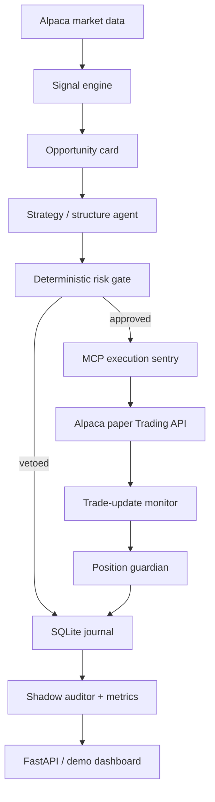
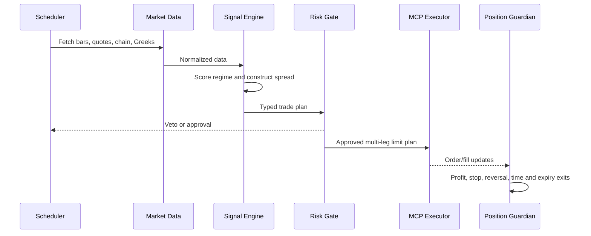

# VegaGuard Architecture and Implementation Plan

## 1. Project goal

Build an autonomous, paper-only options portfolio manager for the Alpaca hackathon. It must generate measurable P&L from a clear strategy, while making every decision, rejection, execution and exit inspectable.

**The product is the P&L engine.** Agents, MCP and the dashboard are the mechanisms that make it autonomous, safe and demonstrable.

## 2. Scope boundary

### In scope

- Volatility-filtered ETF momentum strategy
- Bull-call and bear-put debit spreads, submitted atomically through Alpaca MCP
- SPY, QQQ, IWM first; sector ETFs only after the core loop is stable
- Alpaca market data, paper-account state, orders and trade updates
- autonomous entry, exit and no-trade decisions
- durable audit trail, performance metrics and shadow portfolio
- small dashboard for the live demo

### Explicitly out of scope

- live trading, funding, broker onboarding, transfers or customer accounts
- naked option selling, 0-DTE trades, martingale sizing or portfolio-wide liquidation tools
- a generic conversational trading chatbot
- elaborate forecasting ML before the rule-based strategy is validated
- mobile app, authentication system, multi-user product or React polish before P&L works

## 3. Architecture



### Runtime flow



## 4. Module responsibilities

| Module | Responsibility | Must not do |
| --- | --- | --- |
| `data` | Retrieve and normalize Alpaca bars, quotes, option chains, account, clock and positions | Choose trades or submit orders |
| `strategy` | Compute signal score, expected move and candidate debit spreads | Bypass risk limits |
| `agents` | Turn structured evidence into a thesis and challenge it | Invent market data or execute arbitrary tools |
| `risk` | Deterministically validate every trade and position action | Use LLM judgment as a bypass |
| `execution` | Call only the allowed Alpaca MCP tools and record receipts | Decide strategy or access destructive tools |
| `monitoring` | Consume trade updates, reconcile positions, apply exits | Open fresh positions |
| `storage` | SQLite entities, journal and performance aggregates | Contain trading logic |
| `api` | Expose read model and guarded cycle controls to the dashboard | Embed business logic |

## 5. Data contracts

These typed objects are the boundaries between modules. No module passes unstructured prompt text to another module.

| Object | Key fields |
| --- | --- |
| `MarketSnapshot` | symbol, timestamp, daily/30-min bars, VWAP, volume, realized vol, option snapshots |
| `SignalScore` | total score, component scores, regime, confidence, evidence, rejection reasons |
| `OptionCandidate` | contract symbol, expiry, DTE, strike, call/put, bid/ask, delta, IV, quote timestamp |
| `SpreadPlan` | long leg, short leg, debit, width, max loss, expected move, quantity, limit price, client order ID |
| `RiskDecision` | approved, rule results, blocked reasons, account risk before/after |
| `OrderEvent` | submitted, accepted, partial fill, fill, cancel, reject, timestamps, Alpaca IDs |
| `PositionState` | entry, mark, P&L, time in trade, DTE, exit triggers |
| `ShadowTrade` | alternate structure or no-trade, entry reference, hypothetical exit, counterfactual P&L |

## 6. Repository layout after the refactor

```text
src/vegaguard/
  api/                 # FastAPI routers and response schemas
  core/                # settings, shared models, clock, errors
  data/                # Alpaca REST/MCP adapters and normalizers
  strategy/            # features, scorer, expected move, spread builder, backtest
  agents/              # thesis and critic prompts over typed data
  risk/                # portfolio limits, liquidity and exit rules
  execution/           # MCP client, idempotent order submit, receipts
  monitoring/          # WebSocket trade updates and guardian
  storage/             # sqlite repositories and migrations
  analytics/           # P&L, drawdown, shadow audit, reports
  scheduler.py         # market-hours 15-minute loop
  main.py              # application composition root
tests/
  unit/                # pure feature, signal, spread, risk and P&L tests
  integration/         # mocked Alpaca/MCP lifecycle tests
  fixtures/            # recorded sanitized Alpaca payloads
docs/
```

The present flat prototype is a good scaffold, but we refactor only after its logic has tests. Do not rewrite files merely to make the tree look pretty.

## 7. Implementation phases

### Phase 0 — Account and reproducibility gate

**Deliverable:** one verified new paper account, `.env` configured locally, MCP tool schemas saved without secrets, `pytest` green.

**Done when:** `get_account_info`, `get_clock`, option-chain query and a dry, non-executing cycle work against the dedicated paper account.

### Phase 1 — Historical validation and strategy engine

**Deliverable:** deterministic ETF signal scorer with historical replay and report.

Tasks:

- fetch and cache daily/30-minute ETF bars
- calculate EMA, VWAP, return, volume baseline and realized volatility
- implement the -100 to +100 score from `TRADING_STRATEGY.md`
- construct realistic debit-spread candidates from option snapshots
- model bid/ask cost conservatively and evaluate walk-forward windows
- publish P&L, win rate, profit factor, drawdown and trade count

**Done when:** a command can replay a fixed window and reproduce the same metrics from the same fixture/data snapshot.

### Phase 2 — Live opportunity and spread construction

**Deliverable:** market-hours 15-minute scanner that generates typed `OpportunityCard` and `SpreadPlan` objects.

Tasks:

- normalize Alpaca option snapshots/chains and validate quote freshness
- select 14–28 DTE, delta-targeted call/put legs
- calculate debit, strike width, expected move and position size
- implement no-trade reasons as first-class outputs

**Done when:** a read-only live run produces valid opportunities or clear rejections for every ETF.

### Phase 3 — Agents and deterministic risk gate

**Deliverable:** bounded AI thesis/critic over the strategy output.

Tasks:

- constrain the thesis agent to `trade` or `skip` with cited evidence
- make the critic independently challenge opportunity quality
- enforce deterministic limits: DTE, spread width, risk budget, duplicate orders, market hours, buying power and concentration
- journal all opinions and gate decisions

**Done when:** unit tests prove that an LLM-compatible object cannot increase size, alter legs or bypass a failed rule.

### Phase 4 — MCP execution and lifecycle monitor

**Deliverable:** autonomous paper order and position lifecycle.

Tasks:

- inspect current MCP schemas at runtime; use only approved toolsets
- submit `mleg` debit spreads with idempotent `client_order_id`
- consume `trade_updates`; reconcile REST orders, activities and positions after reconnects
- implement deterministic profit, loss, reversal, time and expiry exits
- persist every transition in SQLite

**Done when:** one paper spread has been placed, filled or rejected, monitored, closed and reconciled with no manual trade action.

### Phase 5 — Shadow audit and portfolio analytics

**Deliverable:** post-trade calibration loop.

Tasks:

- create a shadow alternative for each approved trade
- calculate realized versus shadow P&L after exit
- track critic warnings, signal-score calibration, P&L and drawdown
- use the metrics to adjust a confidence threshold, never raw position size

**Done when:** the dashboard can explain whether the committee helped or hurt a completed trade.

### Phase 6 — Demo interface and submission

**Deliverable:** a small, reliable visual proof—not a second product.

Tasks:

- FastAPI read endpoints for current opportunity, approval trail, order state, position and metrics
- one-page dashboard: signal → committee → risk → MCP receipt → P&L → shadow comparison
- record a 3-minute demo and prepare architecture / setup / paper-account proof

**Done when:** a judge can understand a trade in under 60 seconds and reproduce the setup from the README.

## 8. Test plan

| Level | Tests |
| --- | --- |
| Unit | indicators, signal thresholds, OCC symbol parsing, spread selection, expected move, sizing, every risk rule, each exit rule, P&L calculations |
| Integration | mocked Alpaca chain → plan → MCP receipt; partial fill; reconnect reconciliation; rejected order; duplicate client ID |
| Replay | fixed historical input yields fixed strategy report and no look-ahead data access |
| Paper acceptance | real account query, read-only scan, one approved spread, live event, exit and journal reconciliation |

## 9. Build order and quality gates

Do work in this exact order:

1. validate data and the P&L hypothesis
2. prove the deterministic strategy in replay
3. build live scanning and no-trade logic
4. add AI thesis/critic only around typed evidence
5. add MCP execution and monitoring
6. add analytics
7. add the demo dashboard

If Phase 1 cannot produce a plausible, cost-aware report, change the signal or stop the strategy. Do not hide that problem behind more agents or a prettier UI.

## 10. Immediate next task

Implement Phase 1: indicators, score calculation, replay fixtures and cost-aware performance report. This is where we discover whether VegaGuard has a strategy worth executing.

