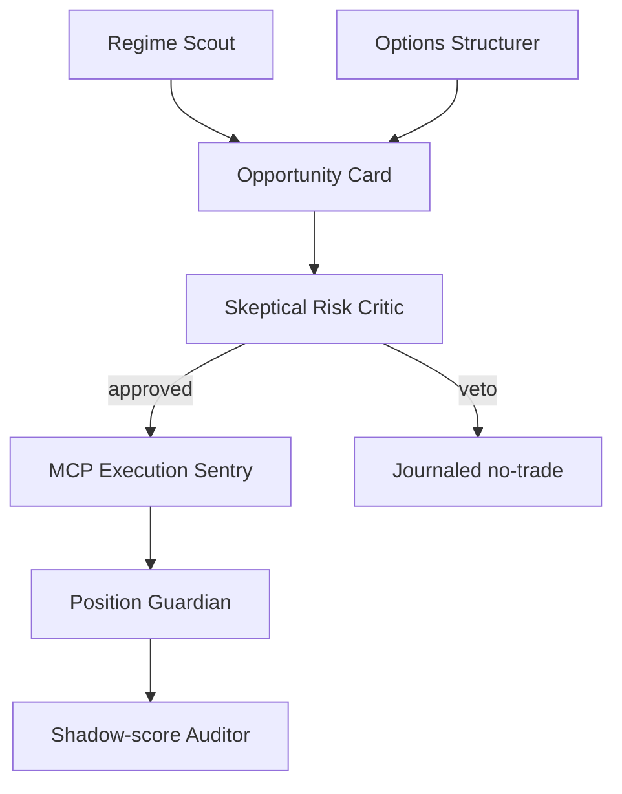

# VegaGuard — Self-Improving Options Investment Committee

## One-line pitch

**VegaGuard is an autonomous paper-options portfolio manager that turns a volatility-filtered ETF momentum signal into defined-risk vertical spreads, then continuously grades every decision against a shadow alternative to improve the next trade.**

## The decision

We are **not** building a generic “ask an AI to buy AAPL” chatbot. That is easy to copy and not strong enough on originality.

We are building a controlled **agentic options portfolio**. It has a clear P&L hypothesis, real paper execution, real multi-leg option structures, visible Alpaca MCP integration, and a learning loop judges can inspect.

## Why this can score highly

| Judging dimension | What VegaGuard demonstrates |
| --- | --- |
| P&L | It actually opens and manages controlled option positions in the dedicated paper account. |
| Technology | Typed agents, live data, option-chain/Greek analysis, MCP v2 execution, streaming order monitor, durable audit log, deterministic guardrails. |
| Originality | The shadow portfolio and post-trade calibration turn the agent from a one-shot predictor into a self-evaluating decision system. |
| Presentation | Every trade has a story: evidence → competing structure → risk veto/approval → MCP receipt → fill/exit → counterfactual score. |

## Trading policy — narrow, explainable, executable

### Universe

Start with **SPY, QQQ, IWM**. Add XLK, XLF and XLE only after trade-state monitoring is stable. They are liquid, option-rich and make the strategy testable across broad and sector regimes.

### Signal

The Regime Scout consumes daily and intraday underlying bars, realized volatility, option-chain bid/ask, Greeks and implied volatility. It scores aligned daily regime, 30-minute trend, volume confirmation, volatility state and market alignment; only an absolute score of 70/100 can reach the committee.

It produces an `OpportunityCard` with:

- directional regime: bullish / bearish / neutral
- 1-day and 5-day return, realized volatility, volume anomaly
- expected move derived from ATM IV and DTE
- contract liquidity and quote freshness
- evidence and explicit “do not trade” reasons

### Structure

The Options Structurer converts only a high-conviction directional card into one of two defined-risk structures:

| Regime | Structure | Why |
| --- | --- | --- |
| Bullish | Bull call debit spread | Upside exposure with maximum loss fixed to the debit. |
| Bearish | Bear put debit spread | Downside exposure with maximum loss fixed to the debit. |

The long leg is near-the-money; the short leg is closer to the forecast move. Both legs have the same expiry, 7–35 DTE. Submit them atomically as an Alpaca `mleg` limit order.

The project does **not** sell naked options, chase zero-DTE contracts, or use a strategy it cannot explain.

### Risk rules

- one spread maximum per underlying
- at most 3 open positions
- one spread / one contract at a time at launch
- initial maximum debit / loss: $500 per trade (0.5% equity risk budget)
- reject wide bid-ask spreads, stale quotes, invalid contracts and low buying power
- no entries close to expiry; mandatory time exit before expiry
- take-profit, stop-loss, time-stop and thesis-invalidation exit are all deterministic

## The agents

### 1. Regime Scout

Uses Alpaca stock bars and option snapshots to make an evidence card. It cannot place orders.

### 2. Options Structurer

Finds valid option contracts at runtime, estimates expected move from IV, proposes a debit spread, and returns max risk and a limit price. It cannot exceed risk limits.

### 3. Skeptical Risk Critic

Acts as adversary: challenges the signal, validates DTE, spread width, delta, max loss, position concentration, market hours and duplicate order ID. It can veto; no LLM can override this deterministic check.

### 4. MCP Execution Sentry

Receives only an approved typed plan. It writes intent to the journal, calls the official Alpaca MCP v2 `place_option_order`, stores the receipt, and never exposes portfolio-wide destructive tools.

### 5. Position Guardian

Consumes Alpaca `trade_updates`, positions and activities. It tracks fills, partial fills, P&L, time-to-expiry, thesis invalidation and exit conditions.

### 6. Shadow-score Auditor — the differentiator

For every executed plan, it records one alternative that was plausible but rejected—for example a single-leg call instead of a bull call spread, or a later entry.

At exit, it compares:

- realized P&L versus the shadow alternative
- forecast confidence versus outcome
- whether the critic’s concerns were predictive
- entry/exit quality and liquidity cost

This produces agent reliability scores that change future confidence thresholds. It is a transparent learning loop, not vague “memory.”

## What the dashboard must show

1. Current market regime and option-chain card
2. The committee’s structured opinions, including a critic veto
3. Approved plan with max loss and exact legs
4. Alpaca MCP tool call / order receipt and live order state
5. Positions, P&L and guardrail usage
6. Journal timeline and a post-trade shadow comparison

## Three-minute demo narrative

1. **0:00–0:30:** Explain the problem: LLM trading tools are powerful but unconstrained agents can make opaque, dangerous orders.
2. **0:30–1:15:** Show the Regime Scout, option chain and two competing trade structures.
3. **1:15–1:45:** Show the Risk Critic rejecting a bad/liquidly unsafe plan and approving only a defined-risk spread.
4. **1:45–2:20:** Show the real MCP `place_option_order` paper-trade result and order-state event.
5. **2:20–3:00:** Show P&L, exit logic, journal and shadow score; explain how the next decision is calibrated.

## Build order

1. Implement the volatility-filtered ETF signal score in [the strategy specification](TRADING_STRATEGY.md).
2. Replace the current single-leg plan builder with atomic bull-call / bear-put debit-spread construction.
3. Add strict chain normalization, expected-move calculation, bid/ask freshness and delta selection.
4. Add `trade_updates` monitoring and deterministic profit, stop and time exits.
5. Add the shadow trade ledger and auditor metrics.
6. Build the dashboard last; the proof is the live decision loop, not UI polish.

## Definition of done

The project is demo-ready only when it can autonomously select **or reject** a real opportunity, place a valid paper multi-leg options order through the MCP server, monitor it with Alpaca events, explain each risk decision, and display the shadow-audit result.
